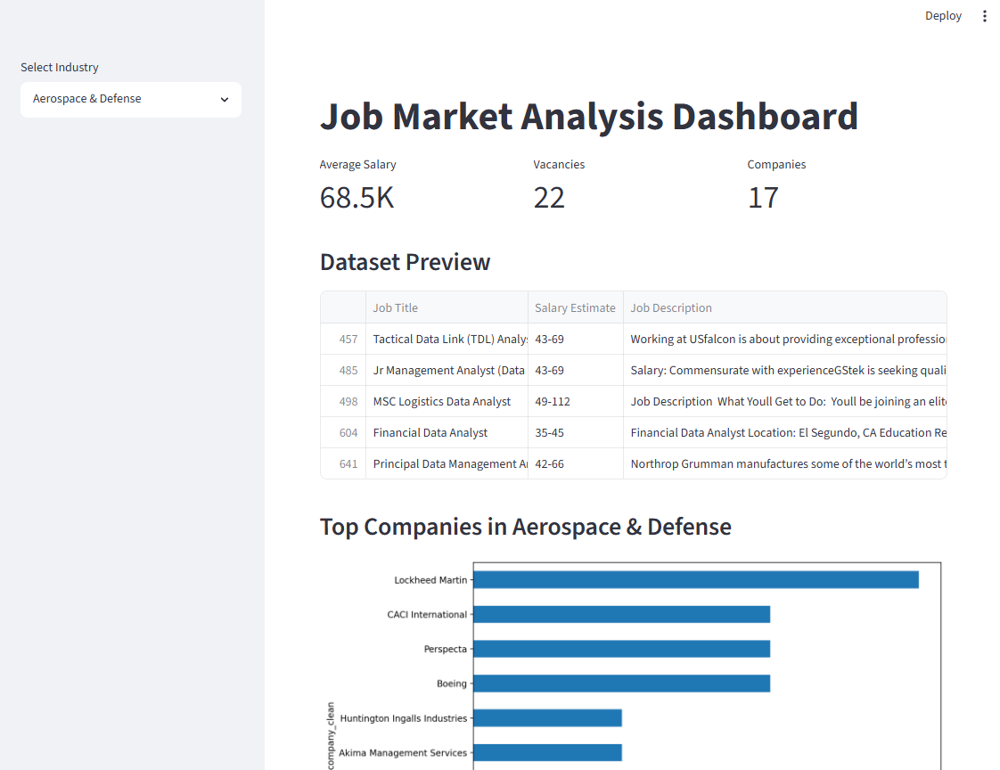

# Дашборд для анализа рынка труда

Интерактивный дашборд для анализа рынка вакансий аналитиков данных с использованием Python, SQL и Streamlit.

---

## Обзор проекта

Этот проект посвящён анализу рынка труда в сфере анализа данных.

Дашборд позволяет пользователям:
- фильтровать вакансии по отрасли,
- исследовать распределение заработных плат,
- анализировать ведущие компании,
- просматривать ключевые показатели (KPI).

---

## Используемые технологии

- Python
- Pandas
- SQL (SQLite)
- Matplotlib
- Streamlit

---

## Основные возможности

- Очистка и предварительная обработка данных
- Анализ заработных плат
- Фильтрация по отраслям
- Отображение ключевых показателей (KPI)
- Интерактивные графики
- Анализ ведущих компаний

---

## Предварительный просмотр дашборда



---

## Структура проекта

```bash
job-market-analysis/
│
├── data/
│   ├── data_jobs.csv
│   └── jobs.db
│
├── notebooks/
│   ├── analysis.ipynb
│   └── sql_analysis.ipynb
│
│
├── images/
│   └── dashboard.png
│
├── app.py
├── requirements.txt
└── README.md
```

---

## Установка

Клонируйте репозиторий:

```bash
git clone <ссылка-на-репозиторий>
```

Установите зависимости:

```bash
pip install -r requirements.txt
```

Запустите дашборд:

```bash
streamlit run app.py
```

---

## Основные выводы

- В сферах здравоохранения и фармацевтики наблюдаются одни из самых высоких уровней заработной платы.
- Большинство вакансий сосредоточено в среднем и высоком диапазонах зарплат.
- Крупные технологические компании стабильно предлагают наиболее конкурентоспособную оплату труда.

---

## Планы по развитию

- Развернуть дашборд в интернете
- Добавить больше визуализаций
- - Реализовать прогнозирование заработной платы с помощью методов машинного обучения
- Подключить API для получения данных в режиме реального времени


---

